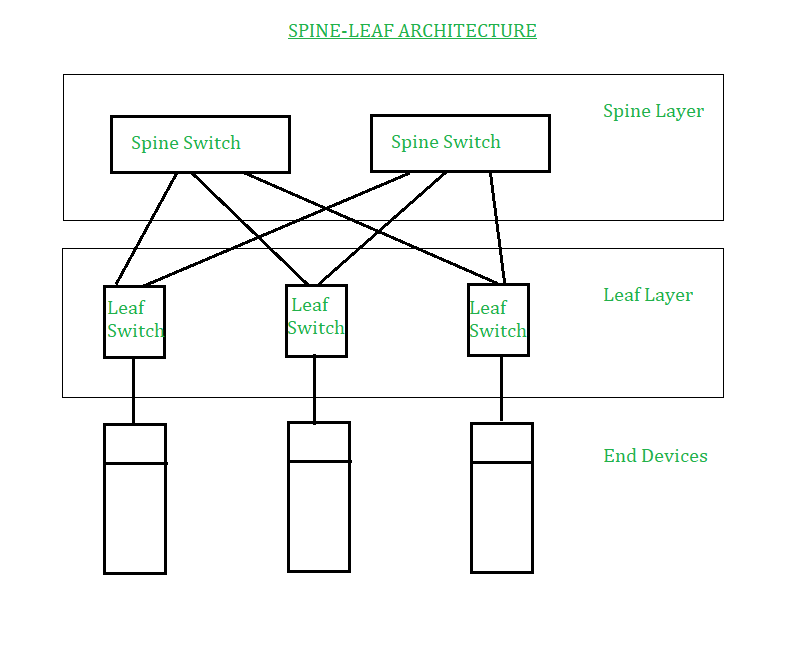
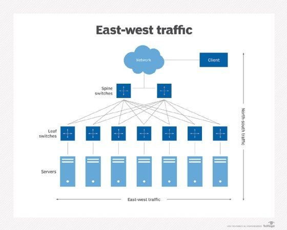

# Networking Fundamentals

## What is a network

- A computer network is a system of interconnected computers and other devices that communicate and share resources/information.
    - At least two devices connected to each other
    
- Networks can be catagorized by their size and structure

- The main purpose of a network is to share resources

## Devices on a Network

- ### Hosts 
    - Hosts are devices or systems on a network that use, provide, or share resources and services such as computers, servers and network enabled devices with an IP address

- ### Server
    - A computer or system that provides resources, data, services or programs to other computers known as clients over a network

- ### Workstation
    - A high performance computer designed for technical or scientific applications often used by one person at a time

- ### Client Machine
    - Computer or device that accesses services, applications, or resources provided by a server over a network

- ### Network Devices 
    - Network devices allow servers, workstations and client computers to connect and share resources.
    - Routers, switches, access points (AP) and firewalls

## Types or Networks

- ### Local Area Network (LAN)
    - Covers a small geographic area
    - Home, Office, or building
    - Used for sharing resources such as files and printers

- ### Wide Area Network (WAN)
    - Covers a large geograhic area
        - Often a country or a continent
    - Internet is the largest example of a WAN

- ### Metropolitan Area Network (MAN)
    - Covers area larger than a LAN but smaller than a WAN
        - Ex. City

- ### Campus Area Network (CAN)
    - Network that connects multiple LANs
    - Limited geographic area such as college campuses or large industrial complex

- ### Storage Area Network (SAN)
    - High speed network that provides access to consilidated data storage
    - SANs are mostly used to enhance storage devices
        - Disk arrays, tape libraries, optical jukeboxes
        - Appear to servers as locally attached devices

- ### Personal Area Network (PAN)
    - Covers a small area
        - Bluetooth

## Peer to Peer vs Client Server

- ### Peer to Peer Network (P2P)
    - Deccentralized network architecture
    - Each device in the network can act as both a client and a server
    - Allows for direct sharing of resources without the need for a central server

- ### CLient Server Network
    - Network architecture where multiple client devices connect to a central server to access shared resources
    - The server manages and provides the requested services
    - The clients initiate requests and utilize requested services

## Backbone vs Segments

- ### Backbone
    - The main infrastructure that interconnects segments of a computer network
    - Comprised of high-speed, high capacity links and core routers
    - Efficient data transfer across a network

- ### Network Segments
    - Smaller sub networks or clusters of devices that connect to the backbone
    - Each segment can include a variety of network devices
    - Segments often represents different departments or areas within an organization
    - Segments rely on the backbone to communicate with other other segments

## Topologies

- ### Network Topologies
    - Describe the layout or arrangement of the elements of a computer network
    - There are several types of topologies, each having certain configurations that impact network performance, reliability and scalability

    - **Point to Point**
        - Direct connection between two networking devices (wired or wireless)
        - Mainly used for dedicated connections between two pieces of network equipment
    
    - **Mesh**
        - Each host is connected to another host
        - Creates a network with no central connecting point
        - Most fault tolerant
        - Expensive
        - Complex
        - Difficult to expand

    - **Star/Hub and Spoke**
        - All nodes are connected to a central node such as hubs, switches, and wireless access points
        - Simplifies network management and troubleshooting
        - creates a single point failue
            - A failure of the central hub can bring down the entire network
    
    - **Hybrid**
        - Combines two or more different topologies
        - Leverages the advantages and mitigates the disadvantages of the constiuent networks
        - Flexible network design that can be tailored to specific needs

## Three Tier Model

- Three tier hierarchical model is a structured approach to network design
- Breaks down networks into three distinct layers
- Each layer is designed for a specific purpose

- Core Layer
    - Backbone of the network
    - Handles high speed packet switching across the entire network
    - Responsible for fast and reliable routing
    - Should have fault tolerance and high redundancy

- Distribution Layer
    - Intermediary layer between core and access layers
    - Manages routing, filter and WAN access
    - Aggregates data received from the access layer switches before it is transmitted to the core layer for routing to its final destination

- Access Layer
    - Network point of entry for devices and end users
    - This layer includes switches and access points
    - Provides connectivity to desktop PC's laptops and other network devices

## Spine and Leaf architecture

- Two layer network topology
- Highly scalable and minimizes latency
- Ensures every leaf switch (access layer) is seperated by no more than two switches from any other leaf switch
- Leaf switches form the access layer where devices are connected
- Spine switches serve as the backbone for data transport connecting all leaf switches without interconnecting to each other

## Collapsed Core Architecture
- Core and distrobution layer are mergered into one layer (Collapsed Core) creating a single layer
- Simplifies network design
- Ideal for small to medium sized networks where managing seperate layers is unnecessary

## North South vs East West Traffic

- ### North-South Traffic
    - Describes the flow of traffic between the data center and the internet/other data centers
    - Focused on inbound/outbound traffic
    - Client to server communication

- ### East-West Traffic
    - Traffic flow within the data center
    - Supports high volumes of internal data exchange
    - Includes:
        - Server to server
        - VM to VM 
        - Server to storage

## Traffic Flow

- ### Unicast
    - One-to-one form of communication
        - Data is sent from one source to another
        - Each source is identified by a unique IP address
    - Most common form of IP communication
        - Used for web browsing, email and file transfers
    - Ensures data packets are delivered to a single specific recepient over a network

- ### Multicast
    - Data is sent to from one or more sources to multiple destinations simultaneously
        - Uses a specific multicast group address
    - Used for applications like video streaming 
        - The same data needs to be delivered to multiple recepients reducing bandwidth consumption
    - Used in both IPv4 and IPv6 networks
    - Optimizes delivery of packets to multiple destinations

- ### Anycast
    - Data is sent to the nearest or best destination as determined by routing protocols
    - Used in IPv6 and to a lesser extent in IPv4
    - Provides fast and efficient delivery of services by directing users to the closest server
        - Used in DNS and Content Delivery Network (CDN) service
    - Improves network performance by automatically routing requests to the nearest data center

- ### Broadcast
    - Message is sent from one sender to all potential receivers within a network segment
    - IPv4
        - The broadcast address is used to send data to all devices on a LAN simultaniously
        - Ex. When a device requests an IP address via DHCP
    - Broadcast is not supported in IPv6
        - Use Multicast 
